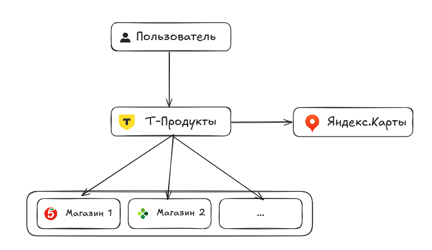
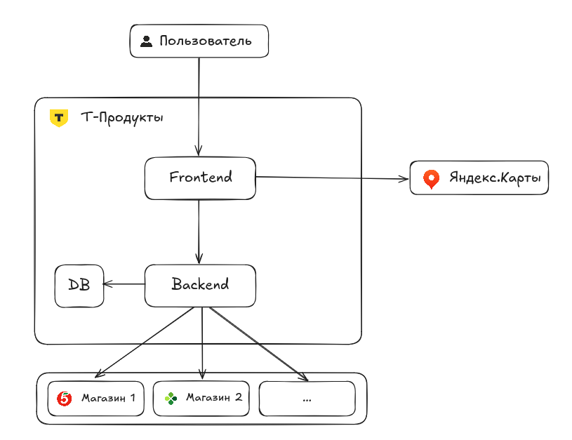
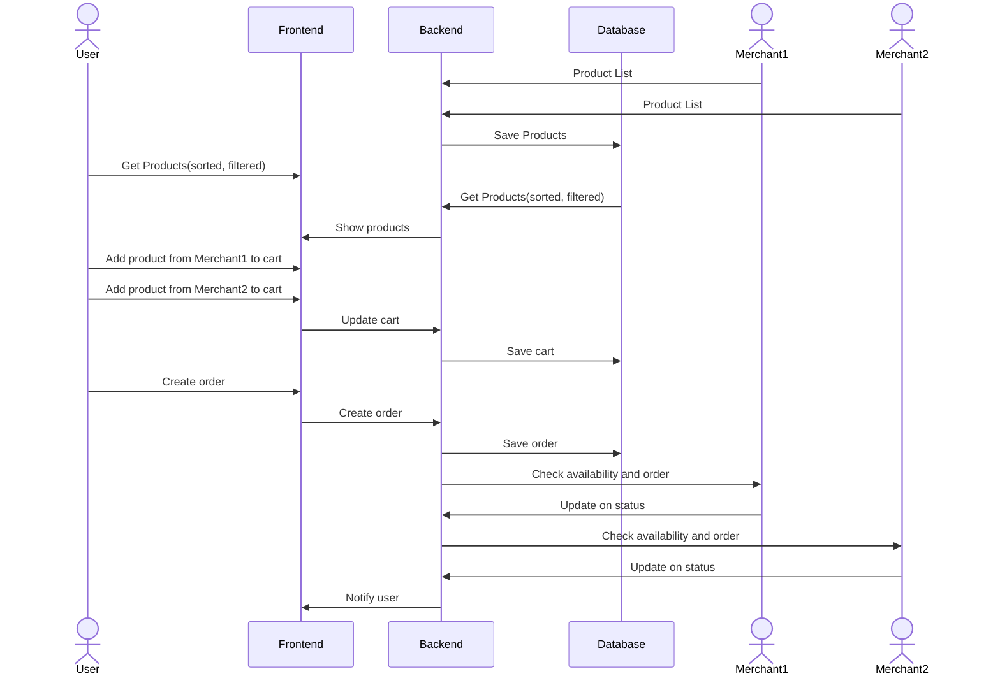
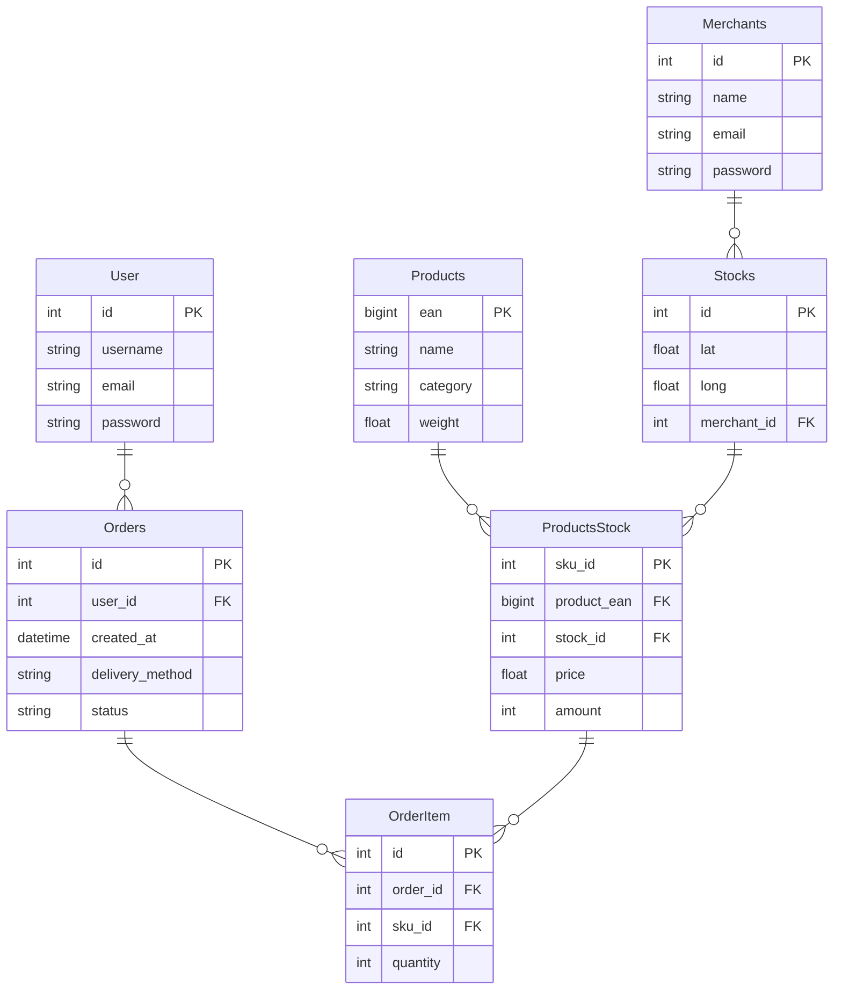
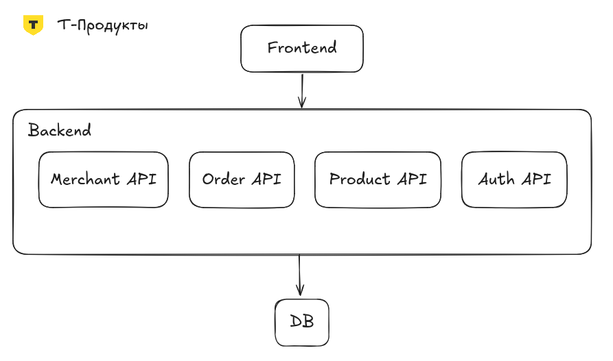

# System design

## Т-продукты

Сайт заказа продуктов из нескольких магазинов.

## 1. Требования

- Функциональные требования
  - Пользователь может зарегистрироваться
  - Пользователь может добавить свой адрес
  - Пользователь может смотреть ленту товаров
  - Пользователь может отфильтровать ее по цене, скорости доставки, магазинам
  - Пользователь может искать товары
  - Пользователь может искать товары в категориях
  - Пользователь может добавлять заказы в корзину
  - Пользователь может смотреть дополнительную информацию о товаре
  - Пользователь может сравнивать товар у разных магазинах
  - Пользователь может выбрать тип доставки: в одно время, по мере поступления, или в ячейке Купер
  - Магазин может добавить информацию о товарах на сайт
- Нефункциональные требования
  - MVP
    - DAU: 50 пользователей, 5 магазинов
    - RPS
      - Write:
        - Магазин обновляет информацию об остатках товаров раз в час
          - (5 * 1) / 60 / 60 => RPS << 1
        - Клиент добавляет товар в корзину 10 раз в день(8 часов)
          - (50 * 10) / 8 / 60 / 60 => RPS << 1
      - Read
        - Клиент ищет товар в каталоге 30 раз в день
          - (50 * 30) / 8 / 60 / 60 => RPS << 1
    - SLA: 95% (Возможный downtime - 18 дней в год)

- Целевой продукт
  - DAU: 1 000 000 пользователей, 20 магазинов
  - RPS
    - Write:
      - Магазин добавляет информацию об остатках товаров раз в день(8 часов)
        - (20 * 1) / 8 / 60 / 60 => RPS << 1
      - Клиент добавляет товар в корзину 10 раз в день(8 часов)
        - (1,000,000 * 10) / 8 / 60 / 60 => RPS = 347
    - Read:
      - Клиент ищет товар в каталоге 30 раз в день
        - (1,000,000 * 30) / 8 / 60 / 60 => RPS = 10,000
  - SLA: 99,5% (Возможный downtime меньше 2 дней в год)

## 2. Границы системы

- Внешние системы
  - Сервис геолокации/карт (для адресов доставки и отображения на карте)
  - Сервисы партнеров

- В планах:
  - Сервис уведомлений (Email, SMS)
  - Платежный шлюз (Robokassa/CloudPayments/...)
  - Аутентификация T-ID



## 3. Компоненты системы и потоки данных



### Масштабирование

- Для реализации требований целевого проекта необходимо
  - Использование кэширования (Redis) для часто запрашиваемых данных (например, лента товаров, детали товаров)
  - Использование CDN для статического контента Frontend
  - Разбитие Backend на микросервисы (Merchant API, Client API), горизонтальное масштабирование
  - Делегирование аутентификации на внешний сервис (Т-ID)
  - Kafka для взаимодействия с партнерами

### Схемы бизнес-процессов

#### От добавления товара продавцом до оплаты заказа

- Необходимо реализовать SSE или WS для уведомления пользователя о статусе заказа
- Backend должен взаимодействовать с платежным шлюзом для оплаты



## 4. API, модель данных

### Database



### API

```
GET: /api/products
GET: /api/products/{id}
GET: /api/categories
GET: /api/merchants
GET: /api/merchants/{id}/products
POST: /api/cart/add
POST: /api/orders
GET: /api/orders/{id}
POST: /api/auth/register
POST: /api/auth/login
POST: /api/users/{id}/address
```

## 5. Выбор конкретных технологий

- Языки и стеки для Frontend: React (JavaScript), Vite, npm
- Языки и стеки для Backend: Python (FastAPI), Uvicorn/Gunicorn
- Реализации БД: PostgreSQL (основная БД)

## 6. Компоненты

### Backend

- **Backend Services:** FastAPI (Python)
  - Модули: `auth`, `product`, `orders`, `merchant_api`, `database`
- **Database:** PostgreSQL

### Frontend

- **Web Server:** Vite (для отдачи статики)
- **Frontend Application:** React (Vite)


